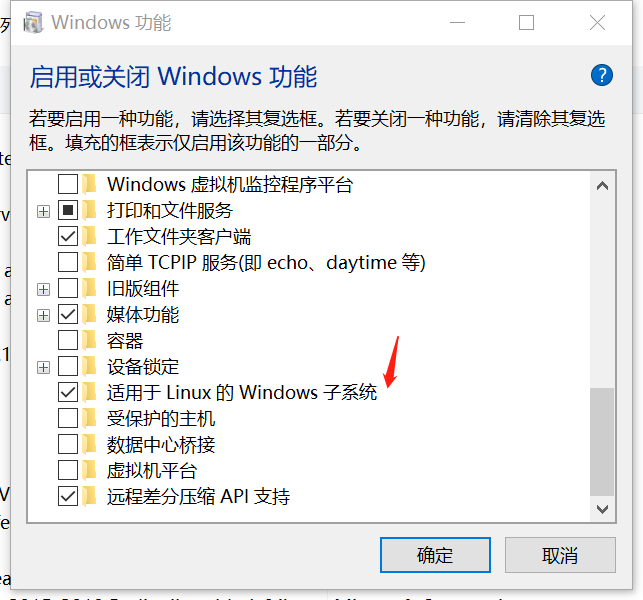
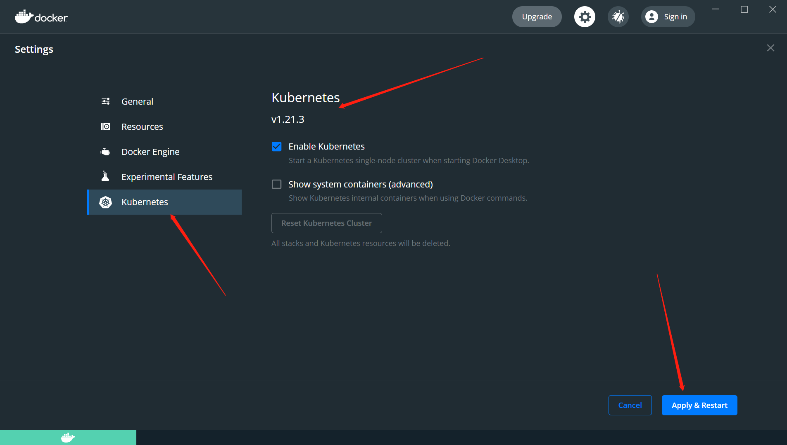

= windows 安装 k8s教程

== 下载docker-desktop 

```
https://www.docker.com/products/docker-desktop
```
== 安装 docker-desktop

=== 前提
* 主板中开启虚拟化
* 开启 windows 子系统



* 开启wsl2并安装 ubuntu 20.4 https://docs.microsoft.com/zh-cn/windows/wsl/install-win10[教程]


=== 下载镜像 

* 管理员 powershell 执行

```
 Set-ExecutionPolicy -ExecutionPolicy Unrestricted -Scope CurrentUser
```

* 确定版本

image::image/2.png[]

* 下载github代码并切换到对应版本下载镜像

=== 开启k8s 



```
大概 2-3分钟
```

=== 然后进入k8s 海洋傲游吧

```
建议所有研发体系人员学习，并合理使用，有很大帮助。

```
